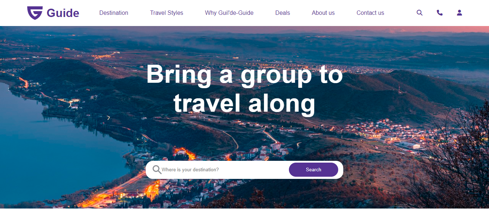
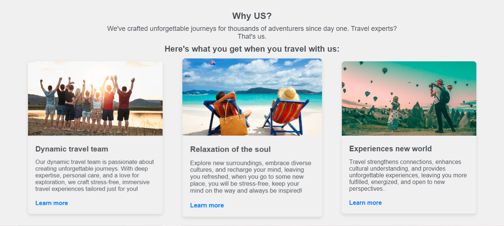
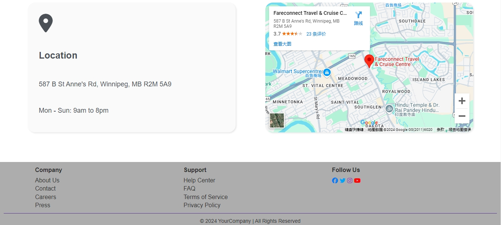

# Travel website template
  

    This travel website template is designed to provide an engaging and 
    user-friendly platform for travel agencies. With its modern design and 
    robust features, it aims to enhance user experience and streamline the 
    process of travel planning.
  

  

    Thistravel website template developed by Creeford, Jiayi and Duan.
  

## 1.Webpage screenshots

- <h3>Home</h3>

- <h3>About-us</h3>

- <h3>Contact-us</h3>

## 2.Features
 - <h3>Responsive Design</h3>
     

     Ensures the website looks great and functions well on various devices, 
     including desktops, tablets, and smartphones. Provides a seamless 
     experience for users on the go, which is essential for travel planning.
     

 - <h3>Visually Appealing Layout</h3>
     

     Uses stunning images of destinations to capture users' attention and 
     inspire them to explore. A well-organized layout with ample white space 
     helps users focus on content without feeling overwhelmed.
     

 - <h3>Intuitive Navigation</h3>
     

     Simple and logical navigation allows users to find information quickly. 
     A prominent search bar helps users locate specific content or services 
     effortlessly.
     

 - <h3>Social Media Integration</h3>
     

     Easy sharing options for users to promote content on their social media 
     platforms, increasing visibility.
     

## 3.The technologies used to build the web app
- <h3>Front-end</h3>
  - HTML (HyperText Markup Language)
  - CSS (Cascading Style Sheets)
- <h3>Version Control</h3>
  - GitHub
- <h3>Hosting and Deployment</h3>
  - Netlify